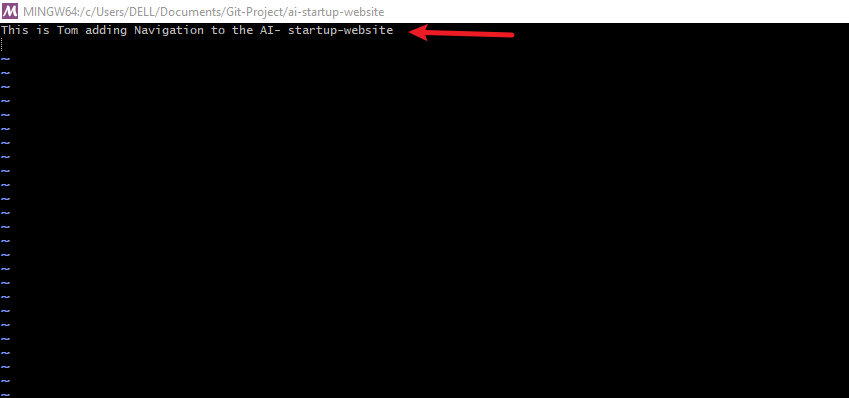
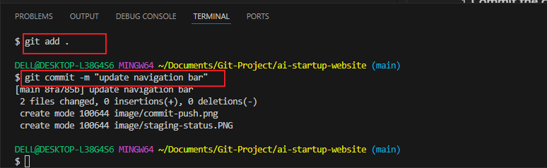

# PART 2: Simulating Tom and Jerry's Work
## `This guide will walk you through the basics of using GitHub, including navigating a project directory, creating branches, making changes, and collaborating with others. We'll simulate workflows for two contributors, Tom and Jerry` 

# Navigating the Project Directory and Checking Branches:
## Steps:

# Install Git

1. ### Download Git:

* Visit the official website to download

* Click [Here](https://git-scm.com/)

* Download the appropriate version for your operating system (Windows, macOS,or Linux).

2. ### Install Git:

* Follow the instructions of your OS (Operating system)

* Once installed, open a terminal or command prompt and verify the installation by running this command:

```git --version```


* This should display the installed version of Git.


# Create Github Repository

* Sign up or log in to [Github](https://github.com/)

* Click the "+" icon in the top right corner and select "New Repository"

* Name your repository (e.g.. "ai-startup-website")

* Click "Create Repository"


# Clone the repository

* On your repository's page on Github, click the "Code" button and copy the HTTPS URL.

* Open your terminal or command prompt

* Create a folder named "git-project"

* Change directory into the "git-project"

* Clone(Download) the repository from Github using:


``` bash
git clone [Paste the URL copied from Github]
``` 

* Since you just clonned your repository, your branch is `main`

* Navigate into the repository you just clonned.


3. ### Navigate to the project directory you just cloned using the command:
``` bash
cd ai-startup-website
```
4. ### Check the current branch in repository using:
``` bash
git branch
```
This will display all the branches in the repository.

5. ### Create a new branch called `update-navigation`
``` bash 
git branch update-navigation
```
6. ### Verify the new branch by running git branch again. You should see the newly created branch listed.


# Making Changes and Staging Them
## Steps:

1. ### Open the index.html file in your code editor. Since this file already exists in the main branch, it will also exist in the new branch you created.

2. ### Add the following content to the index.html file:

``` bash
This is Tom adding Navigation to the ai-startup-website
```


3. ### Check the status of your changes using:
``` bash
git status
```
This will show that the change has not been staged yet.
Staging the change using `git add .`


# Committing and Pushing Changes.

Steps:

1. ### Commit the change with a message.

``` bash 
git commit -m "update the navigation bar"
```


2. ### Push the branch to GitHub using:

``` bash 
git push origin main
```


# Simulating Jerry's Contribution:
Steps:

1. ### Switch back to the update-navigation branch:
``` bash
git checkout main
```